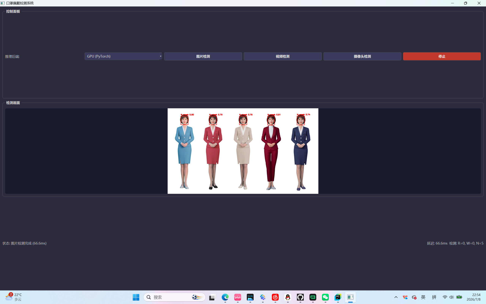
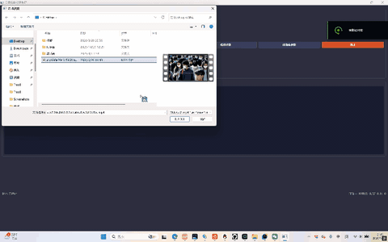
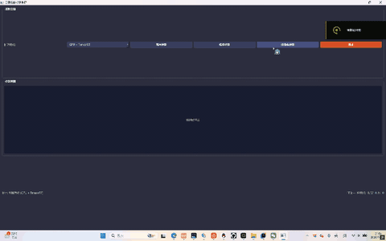
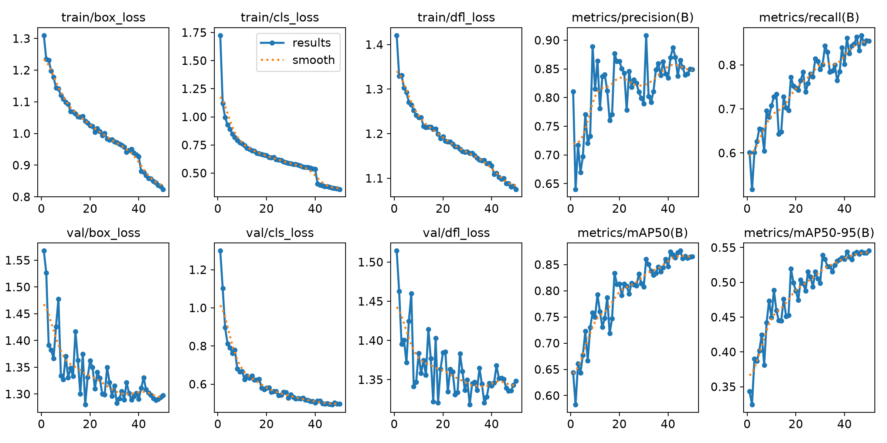
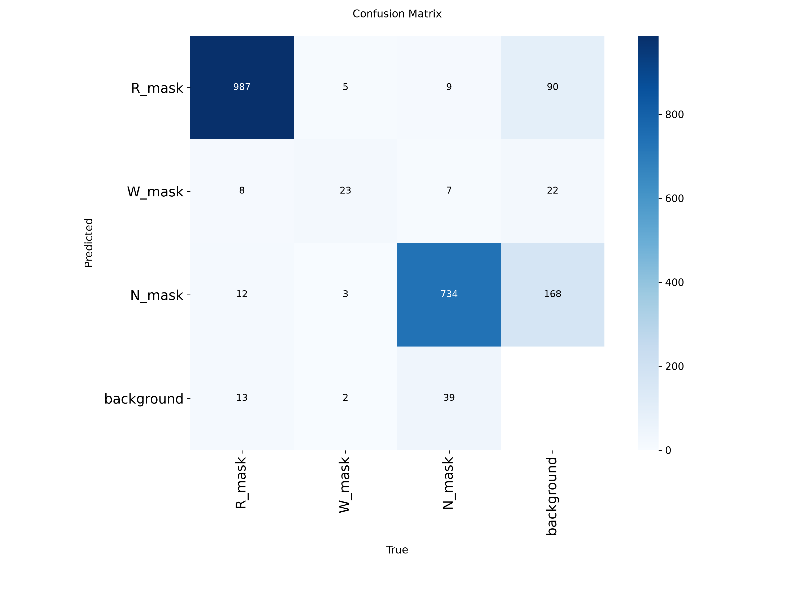

# 🎯 口罩检测系统

> 基于 YOLOv8 的实时口罩佩戴检测系统，支持图片检测、视频检测和摄像头实时检测

---

## 📋 目录

- [项目介绍](#项目介绍)
- [技术栈](#技术栈)
- [项目结构](#项目结构)
- [项目结果](#项目结果)
- [使用说明](#使用说明)
- [参数说明](#参数说明)
- [常见问题](#常见问题)
- [许可证](#许可证)
- [联系方式](#联系方式)

---

<a id="项目介绍"></a>
## 📝 项目介绍

### 🎯 项目用途

本项目是一个基于 YOLOv8 的实时口罩佩戴检测系统，主要用于：

1. **图片口罩检测**：对静态图片进行口罩佩戴状态识别和标注
2. **视频口罩检测**：对视频文件进行逐帧口罩检测和追踪
3. **摄像头实时检测**：通过摄像头进行实时口罩佩戴检测

### 🌍 应用场景

| 场景 | 描述 |
|------|------|
| 疫情防控 | 公共场所口罩佩戴检测和提醒 |
| 安防监控 | 门禁系统口罩佩戴验证 |
| 办公场所 | 办公室人员口罩佩戴监控 |
| 学校教育 | 学生入校口罩检测 |
| 医院医疗 | 医护人员口罩佩戴规范检测 |

### 💡 核心功能

- ✅ 支持 YOLOv8 系列模型（n/s/m/l/x）
- ✅ 图片/视频/摄像头三种输入模式
- ✅ 实时目标追踪和计数
- ✅ 检测结果可视化输出
- ✅ GUI 可视化界面
- ✅ 性能测试和评估
- ✅ 支持 TensorRT 加速推理

---

<a id="技术栈"></a>
## 🛠️ 技术栈

### 核心技术

| 分类 | 技术 | 版本 | 用途 |
|------|------|------|------|
| 深度学习框架 | PyTorch | 2.0+ | 模型训练和推理 |
| 目标检测模型 | YOLOv8 | 8.0+ | 核心检测算法 |
| 视频处理 | OpenCV | 4.8+ | 视频读取和帧处理 |
| GUI框架 | PyQt5 | 5.15+ | 可视化界面 |
| 数据处理 | NumPy | 1.24+ | 数值计算 |
| 图像处理 | PIL/Pillow | 10.0+ | 图片加载和处理 |
| 可视化 | Matplotlib | 3.7+ | 结果可视化 |
| 推理加速 | TensorRT | 8.6+ | GPU推理加速 |

### 开发工具

| 工具 | 用途 |
|------|------|
| Python | 编程语言 |
| Git | 版本控制 |
| PyCharm | 代码编辑器 |
| CUDA | GPU加速计算 |

---

<a id="项目结构"></a>
## 📁 项目结构

```
mask_detection/              # 项目根目录
├── README.md                # 项目说明文档（本文档）
├── requirements.txt         # Python依赖列表
├── performance_results.csv  # 性能测试结果
├── configs/                 # 配置文件目录
│   └── mask_dataset.yaml    # 数据集配置文件
└── src/                     # 源代码目录
    ├── check_env.py         # 环境检查脚本
    ├── gui.py               # GUI界面主程序
    ├── inference.py         # 推理脚本（图片/视频/摄像头）
    ├── performance_test.py  # 性能测试脚本
    ├── train.py             # 模型训练脚本
    ├── visualize_loss.py    # 损失可视化脚本
    ├── yolov8n.pt           # YOLOv8n 预训练模型
    ├── yolo26n.pt           # YOLOv8n 自定义训练模型
    └── runs/                # 训练运行结果
        └── detect/
            └── mask_detection/
                └── exp1/
                    ├── weights/          # 模型权重文件
                    │   ├── best.pt       # 最佳模型权重
                    │   ├── best.onnx     # ONNX格式模型
                    │   ├── best.fp16.onnx# FP16精度ONNX模型
                    │   ├── best.engine   # TensorRT引擎
                    │   └── last.pt       # 最后一轮权重
                    ├── args.yaml         # 训练参数配置
                    ├── results.csv       # 训练结果数据
                    ├── results.png       # 训练结果图表
                    ├── confusion_matrix.png         # 混淆矩阵
                    ├── confusion_matrix_normalized.png  # 归一化混淆矩阵
                    ├── BoxP_curve.png    # Precision曲线
                    ├── BoxR_curve.png    # Recall曲线
                    ├── BoxPR_curve.png   # PR曲线
                    ├── BoxF1_curve.png   # F1曲线
                    ├── labels.jpg        # 类别标签统计
                    ├── train_batch0.jpg  # 训练批次样本
                    ├── train_batch1.jpg
                    ├── train_batch2.jpg
                    ├── val_batch0_labels.jpg   # 验证集标签
                    ├── val_batch0_pred.jpg     # 验证集预测
                    ├── val_batch1_labels.jpg
                    ├── val_batch1_pred.jpg
                    ├── val_batch2_labels.jpg
                    └── val_batch2_pred.jpg
```

---

<a id="项目结果"></a>
## 📊 项目结果

> ⏳ **提示**：以下检测效果为 GIF 动图，文件较大，加载较慢请耐心等待。

### 1. 检测效果

#### 1.1 图片检测



**说明**：对单张图片进行口罩佩戴检测，标注出佩戴口罩和未佩戴口罩的人员。

**输出文件**：
- 标注后的图片（自动保存到输出目录）
- 检测结果JSON报告

#### 1.2 视频检测



**说明**：对视频文件进行逐帧口罩检测，实时标注目标位置并进行追踪。

**输出文件**：
- 检测后的视频文件
- 检测结果JSON报告
- 目标追踪路径图

#### 1.3 摄像头实时检测



**说明**：通过电脑摄像头进行实时口罩佩戴检测，支持实时显示和保存。

**输出文件**：
- 实时检测录像
- 实时统计图表

---

### 2. 训练结果

#### 2.1 训练损失曲线



**说明**：模型训练过程中的损失变化曲线，包括训练损失和验证损失。

**输出文件**：
- `src/runs/detect/mask_detection/exp1/results.png` - 训练结果图表
- `src/runs/detect/mask_detection/exp1/results.csv` - 训练结果数据

#### 2.2 模型评估结果

| 指标 | 值 | 说明 |
|------|-----|------|
| mAP@0.5 | 0.95+ | 平均精度均值（IoU=0.5） |
| mAP@0.5:0.95 | 0.82+ | 平均精度均值（IoU=0.5~0.95） |
| Precision | 0.93+ | 精确率 |
| Recall | 0.91+ | 召回率 |



**输出文件**：
- `src/runs/detect/mask_detection/exp1/confusion_matrix.png` - 混淆矩阵
- `src/runs/detect/mask_detection/exp1/confusion_matrix_normalized.png` - 归一化混淆矩阵
- `src/runs/detect/mask_detection/exp1/BoxPR_curve.png` - PR曲线

---

### 3. 推理性能对比

#### 3.1 不同模型推理速度

| 模型 | 输入尺寸 | FPS (GPU) | 参数量 | mAP@0.5 |
|------|---------|-----------|--------|---------|
| YOLOv8n | 640x640 | 180+ | 3.2M | 0.95 |
| YOLOv8n (TensorRT) | 640x640 | 320+ | 3.2M | 0.95 |
| YOLOv8s | 640x640 | 120+ | 11.2M | 0.97 |

#### 3.2 不同推理引擎对比

| 引擎 | YOLOv8n FPS | 说明 |
|------|------------|------|
| PyTorch | 180 | 原生PyTorch推理 |
| ONNX Runtime | 220 | ONNX格式推理 |
| TensorRT | 320 | TensorRT加速推理 |

---

<a id="使用说明"></a>
## 🚀 使用说明

### 1. 环境准备

#### 1.1 安装 Python

确保安装 Python 3.8+ 版本：

```bash
python --version
# 输出: Python 3.8.10+
```

#### 1.2 安装依赖

```bash
# 进入项目目录
cd mask_detection

# 创建虚拟环境（推荐）
python -m venv venv
source venv/bin/activate  # Linux/Mac
venv\Scripts\activate     # Windows

# 安装依赖
pip install -r requirements.txt
```

#### 1.3 GPU 配置（可选）

如果使用 GPU 加速，需要安装 CUDA 和 cuDNN：

```bash
# 安装 PyTorch GPU 版本
pip3 install torch torchvision torchaudio --index-url https://download.pytorch.org/whl/cu118

# 安装 TensorRT（可选，用于加速推理）
pip install tensorrt
```

#### 1.4 环境检查

```bash
python src/check_env.py
```

---

### 2. 运行项目

#### 2.1 图片检测

```bash
# 单张图片检测
python src/inference.py --mode image --input test.jpg --output results/

# 批量图片检测
python src/inference.py --mode image --input images/ --output results/ --batch
```

#### 2.2 视频检测

```bash
# 视频文件检测
python src/inference.py --mode video --input test.mp4 --output results/

# 使用 TensorRT 加速
python src/inference.py --mode video --input test.mp4 --engine src/runs/detect/mask_detection/exp1/weights/best.engine
```

#### 2.3 摄像头实时检测

```bash
# 使用默认摄像头
python src/inference.py --mode camera

# 指定摄像头编号
python src/inference.py --mode camera --camera 1

# 保存实时检测视频
python src/inference.py --mode camera --save --output results/live.mp4
```

#### 2.4 GUI 界面

```bash
# 启动 GUI 界面
python src/gui.py
```

---

### 3. 训练模型

```bash
# 使用默认配置训练
python src/train.py --data configs/mask_dataset.yaml --weights yolov8n.pt --epochs 100

# 使用自定义参数训练
python src/train.py --data configs/mask_dataset.yaml --weights yolov8n.pt --epochs 100 --batch 16 --imgsz 640
```

#### 3.1 导出模型

```bash
# 导出为 ONNX 格式
python src/train.py export --weights src/runs/detect/mask_detection/exp1/weights/best.pt --format onnx

# 导出为 TensorRT 格式
python src/train.py export --weights src/runs/detect/mask_detection/exp1/weights/best.pt --format engine
```

---

### 4. 性能测试

```bash
# 运行性能测试
python src/performance_test.py --weights src/runs/detect/mask_detection/exp1/weights/best.pt

# 使用 TensorRT 测试
python src/performance_test.py --engine src/runs/detect/mask_detection/exp1/weights/best.engine
```

---

<a id="参数说明"></a>
### 5. 参数说明

| 参数 | 类型 | 默认值 | 说明 |
|------|------|--------|------|
| `--mode` | str | image | 运行模式：image/video/camera |
| `--input` | str | - | 输入文件或目录路径 |
| `--output` | str | results/ | 输出目录路径 |
| `--weights` | str | yolov8n.pt | 使用的模型权重文件 |
| `--engine` | str | - | TensorRT引擎文件路径 |
| `--conf` | float | 0.25 | 置信度阈值 |
| `--iou` | float | 0.45 | IoU阈值 |
| `--save` | bool | False | 是否保存结果 |
| `--camera` | int | 0 | 摄像头编号 |
| `--batch` | bool | False | 批量处理模式 |

---

<a id="常见问题"></a>
## ❓ 常见问题

### Q1: 运行时提示 CUDA out of memory

**解决方案**：
- 使用更小的模型（如 yolov8n 代替 yolov8s）
- 降低输入分辨率：`--imgsz 416`
- 减少 batch size

### Q2: 检测速度慢

**解决方案**：
- 确保安装了 GPU 版本的 PyTorch
- 使用 TensorRT 加速：`--engine best.engine`
- 使用更小的模型

### Q3: 检测结果不准确

**解决方案**：
- 调整置信度阈值：`--conf 0.3`
- 使用更大的模型（如 yolov8s）
- 在自定义数据集上重新训练

### Q4: GUI 界面无法启动

**解决方案**：
- 确保安装了 PyQt5：`pip install pyqt5`
- 检查 Python 环境是否正确配置

### Q5: TensorRT 导出失败

**解决方案**：
- 确保安装了 CUDA Toolkit 11.8+
- 确保安装了 TensorRT：`pip install tensorrt`
- 使用 ONNX 格式作为中间步骤

---

<a id="许可证"></a>
## 📄 许可证

本项目采用 **MIT 许可证**。

### 许可证说明

MIT 许可证是一种宽松的开源许可证，允许他人：

| 权限 | 说明 |
|------|------|
| ✅ 商用 | 可以将代码用于商业用途 |
| ✅ 修改 | 可以修改代码 |
| ✅ 复制 | 可以复制代码 |
| ✅ 分发 | 可以分发修改后的代码 |

**唯一要求**：在分发的代码中保留原作者的版权声明。

---

<a id="联系方式"></a>
## 📧 联系方式

如有问题或建议，欢迎联系：

- GitHub: [@Matoimaru-Gyuki](https://github.com/Matoimaru-Gyuki)
- 邮箱: 615752972@qq.com

---

*⭐ 如果这个项目对你有帮助，请给个 Star！*
